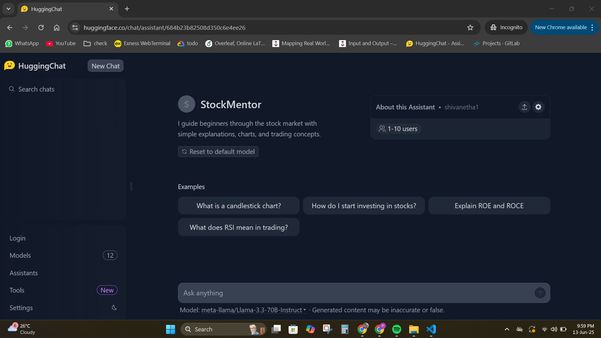
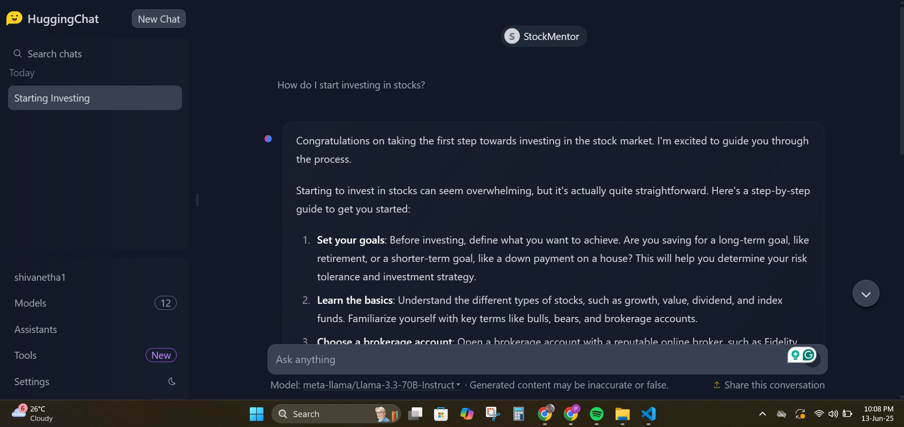

# 📈 StockMentor AI Assistant for Stock Market Beginners

**StockMentor** is an open-source AI assistant built using the powerful `meta-llama/Llama-3.3-70B-Instruct` model via Hugging Face’s Assistants. It helps users perform both technical and fundamental stock market analysis in a conversational format.

---

## 💡 Features

- 📊 Real-time stock analysis (technical indicators, charts)
- 📊 Teaches technical analysis: support/resistance, RSI, MACD, candlestick patterns.
- 📚 Fundamental insights (P/E ratio, earnings, news)
- 🤖 Built on Meta’s LLaMA 3.3 70B Instruct
- 💬 Friendly & educational tone

---

## 🧠 System Prompt

> "You are StockMentor, an expert AI assistant that guides users through stock market analysis. Offer both technical and fundamental insights. Keep the responses practical, beginner-friendly, and concise, while optionally explaining technical terms."

---

## 🛠️ Model Details

- **Model**: `meta-llama/Llama-3.3-70B-Instruct`
- **Hosted on**: Hugging Face Assistants
- **Link**: [StockMentor Assistant](https://huggingface.co/chat/assistant/684b23b82508d350c6e4ee26)

---

## 🖼️ Preview

---

## 📂 Files Included

| File | Description |
|------|-------------|
| `README.md` | Full documentation |
| `assistant_config.json` | Config JSON exported from Hugging Face |
| `screenshots/` | Assistant preview screenshot |

---

## 🌐 Contribute

Feel free to fork this project, suggest improvements, or use it as a base for your own assistant!

